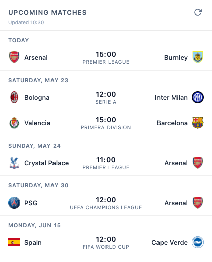

# Football Match Tracker

A Chrome extension that shows upcoming matches for your favorite football teams, inspired by the FotMob mobile widget.



## Features

- Pick your teams via the built-in settings panel — no code editing required
- Upcoming fixtures grouped by date (Today / date)
- Shows team crests, kick-off times, and competition names
- Live scores and final results
- Club and national team crests split by a divider in the header
- Click any crest to temporarily hide that team's matches
- Follows system dark/light mode
- Badge on the toolbar icon shows today's match count
- Tooltip shows today's fixtures or the next upcoming match
- Caches results for 1 hour to stay within API rate limits

## Setup

1. Clone the repo
2. Copy `config.example.js` to `config.js` and add your API key:
   ```js
   const API_KEY = "your_key_here";
   ```
3. Get a free key at [football-data.org](https://www.football-data.org/client/register)
4. Go to `chrome://extensions` → enable **Developer mode** → **Load unpacked** → select this folder

## Adding teams

Click the ⚙ icon in the extension header, pick a competition from the dropdown, then click **Add** next to any team. To stop tracking a team, click **×** on its chip in the settings panel.

> **Note:** The free tier covers the major European leagues, Champions League, and international tournaments (World Cup, Euros). MLS and some smaller leagues are not available.

## Data sources

- Fixtures and team data: [football-data.org](https://www.football-data.org) free tier
- Live scores: [FotMob](https://www.fotmob.com)

## Development

```
npm test
```

Tests cover match filtering logic and date utility functions (Jest, `TZ=UTC`).
